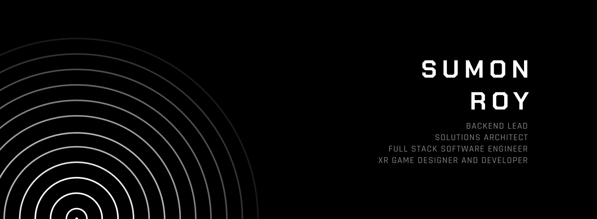

  

<!-- Hero Section -->

  <svg width="600" height="80" role="img" aria-label="Nomoskar, I'm Sumon">
    <defs>
      <linearGradient id="grad1">
        <stop offset="0%" stop-color="#ffffff">
          <animate attributeName="stop-color" values="#ffffff;#888888;#ffffff" dur="4s" repeatCount="indefinite" />
        </stop>
        <stop offset="100%" stop-color="#888888">
          <animate attributeName="stop-color" values="#888888;#ffffff;#888888" dur="4s" repeatCount="indefinite" />
        </stop>
      </linearGradient>
    </defs>
    <text x="50%" y="35" dominant-baseline="middle" text-anchor="middle" font-family="'Chakra Petch', monospace" font-size="28" fill="url(#grad1)">
      <tspan x="50%" dy="0">Nomoskar 🙏🏼 I'm Sumon Roy</tspan>
      <tspan x="50%" dy="32">& I am Architecting</tspan>
    </text>
  </svg>
   
  

---

### 📄 Professional Summary
Results-driven Software Engineer & Full-Stack Developer skilled in Go, Java, JavaScript, and Python. Experienced in architecting and delivering high-performance microservices and distributed systems on Kubernetes and AWS. Proven track record across fintech, health tech, and XR domains, driving scalability, reliability, and innovation.

---

### 🚀 Quick Facts
- ☕ Solved my first critical bug at 2 AM over ginger tea.
- 🌱 Currently exploring Agentic AI, Blender Python automation, and OpenTelemetry.
- 💡 Passionate about designing fault-tolerant architectures and solving complex problems.

---

### 🏢 Experience
- **Swiggy** — Software Development Engineer II (Mar 2025 – Present)
  - Built and optimized high-throughput microservices handling millions of orders daily using Go and Java.
  - Architected fault-tolerant systems on Kubernetes, integrated Kafka for real-time streaming, and managed PostgreSQL clusters on AWS.
  - Mentored junior engineers and drove architectural decisions for new platform features.

- **Wits Innovation Labs** — Software Engineer / Backend Lead (Jan 2023 – Feb 2025)
  - Led backend architecture for enterprise projects using Go, Node.js, Java, and Kubernetes.
  - Integrated IBM DB2, YugabyteDB, RabbitMQ, and Kafka for scalable data workflows.
  - Collaborated with cross-functional teams to deliver robust fintech and health-tech solutions.

- **DestinyWorld** — Software Developer (Oct 2021 – Oct 2022)
  - Developed blockchain-backed applications using Node.js and React.
  - Implemented secure APIs and integrated decentralized tech into web frontends.

---

### 💻 Featured Projects
| Project                          | Tech Stack                                           | Highlights                                                           |
|----------------------------------|------------------------------------------------------|----------------------------------------------------------------------|
| **NPS 2.0**                      | Go, NestJS, Kubernetes, IBM DB2, Kafka               | Scalable National Pension System microservices with real-time streaming |
| **Qurate (Protean)**             | GoFiber, YugabyteDB, Kafka, RabbitMQ                 | Orchestration SaaS for IDP & payment workflows, built observability with OpenTelemetry |
| **Herbalife Lifestyle Program**  | Quarkus, Java, MongoDB, Docker, Apigee               | Health tracking platform with API management & secure deployments    |
| **BasicMining Platform**         | Node.js, Express, MongoDB, Docker                    | E-commerce marketplace for crypto mining rigs, with fiat/crypto payments |
| **Blast XR Golf & Baseball**     | Unity3D, C#, VR/MR/AR, IoT Sensors                    | Immersive simulations for Meta Quest with real-time shot analytics   |

---

### 🛠️ Tech Stack

  

---

### 🎓 Education
- **B.Tech**, Computer Science & Engineering, Government College of Engineering and Leather Technology, Kolkata (2021–2023)
- **Diploma**, Computer Science & Technology, Kanyapur Polytechnic, Asansol (2017–2020)

---

### 📫 Connect with Me

  
  
  

---

  

